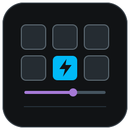
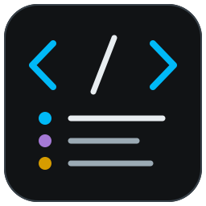
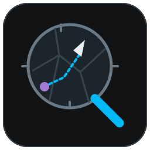

# Plugins FFXIV d'Aleqsd

Un seul dépôt à ajouter dans Dalamud pour installer et mettre à jour les trois plugins.

| | Plugin | Usage |
| --- | --- | --- |
|  | [Hotbar Atelier](https://github.com/Aleqsd/hotbar-atelier) | Personnaliser les barres d'actions. |
|  | [Codex Monitor](https://github.com/Aleqsd/codex-monitor) | Voir les tâches Codex et leurs notifications en jeu. |
|  | [Minimap Zoom](https://github.com/Aleqsd/minimap-zoom) | Dézoomer et personnaliser la mini-carte. |

## Installation

1. Dans Dalamud, ouvrir les paramètres, puis **Dépôts de plugins personnalisés**.
2. Ajouter cette URL, activer la ligne et enregistrer :

```text
https://raw.githubusercontent.com/Aleqsd/dalamud-plugins/main/repo.json
```

3. Revenir à la liste des plugins, chercher le plugin et cliquer sur **Installer**.

Si tu utilisais une DLL de développement, désactive cette copie et retire uniquement son entrée de **Dev Plugin Locations** avant l'installation depuis ce dépôt. Garde tes fichiers de configuration et une seule copie chargée.

## Mises à jour

Garde la même URL. Lorsqu'une nouvelle version est publiée **dans ce catalogue**, Dalamud la repère et propose de la mettre à jour. Plus besoin de télécharger les DLL ou de modifier leurs chemins. Le moment de la mise à jour dépend de tes réglages Dalamud ; tu peux aussi la lancer depuis la liste des plugins.

Une release GitHub seule ne suffit pas : le catalogue est mis à jour avec sa version et son archive.

## Codex Monitor

Ouvre `/codex config`, puis **Connexion → Lancer le relais**. Il faut **Node.js 22.22.2 minimum**, Codex et, pour le quota, le CLI Codex connecté. Le relais démarre sans fenêtre PowerShell.

Depuis la **0.9.0**, tu peux aussi choisir le lancement automatique après connexion au personnage dans **Connexion**. Cette option est désactivée par défaut.

Les scripts du relais sont inclus dans le plugin ; une mise à jour apporte les nouveaux scripts pour son prochain lancement. Node.js et le CLI restent installés séparément. Un relais externe déjà actif est conservé et se met à jour manuellement. Le [lancement séparé](https://github.com/Aleqsd/codex-monitor/tree/main/bridge) reste possible.

Après la mise à jour **0.11.0**, relance le relais intégré depuis **Connexion** pour recevoir les extraits de questions. Leur affichage dans les notifications est facultatif. Si tu utilises un relais externe, mets-le à jour et relance-le depuis son dossier.

Versions expérimentales, pour Dalamud API 15. Les dernières versions ont été vérifiées hors jeu ; leur comportement en jeu reste à confirmer. Ce dépôt personnalisé ne fait pas partie du catalogue officiel.

[Maintenance du catalogue](docs/MAINTENANCE.md) · [Provenance des fichiers](catalogue.lock.json)
