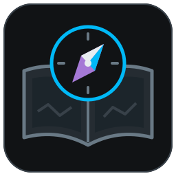
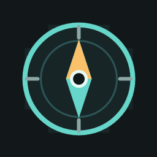

# Plugins FFXIV d'Aleqsd

Un seul dépôt à ajouter dans Dalamud pour installer et mettre à jour ces plugins.

| | Plugin | Usage |
| --- | --- | --- |
|  | [Hotbar Atelier](https://github.com/Aleqsd/hotbar-atelier) | Personnaliser les barres d'actions. |
|  | [Codex Monitor](https://github.com/Aleqsd/codex-monitor) | Voir les tâches Codex et leurs notifications en jeu. |
|  | [Minimap Zoom](https://github.com/Aleqsd/minimap-zoom) | Dézoomer et personnaliser la mini-carte. |
|  | [Cycle & Opener](https://github.com/Aleqsd/cycle-opener) | Cycles et ouvertures par niveau pour 21 jobs de combat, hors Mage bleu. |
|  | [Aether Compass](https://github.com/Aleqsd/aether-compass) | Priorités de progression niveau 100, équipement, quêtes et weekly. |

## Installation

1. Dans Dalamud, ouvrir les paramètres, puis **Dépôts de plugins personnalisés**.
2. Ajouter cette URL, activer la ligne et enregistrer :

```text
https://raw.githubusercontent.com/Aleqsd/dalamud-plugins/main/repo.json
```

3. Revenir à la liste des plugins, chercher le plugin et cliquer sur **Installer**.

Si tu utilisais une DLL de développement, désactive cette copie et retire uniquement son entrée de **Dev Plugin Locations** avant l'installation depuis ce dépôt. Garde tes fichiers de configuration et une seule copie chargée.

## Mises à jour

Garde la même URL. Lorsqu'une nouvelle version est publiée **dans ce catalogue**, Dalamud la repère et propose de la mettre à jour. Plus besoin de télécharger les DLL ou de modifier leurs chemins. Le moment de la mise à jour dépend de tes réglages Dalamud ; tu peux aussi la lancer depuis la liste des plugins.

Une release GitHub seule ne suffit pas : le catalogue est mis à jour avec sa version et son archive.

## Cycle & Opener

Ouvre `/cycle` pour consulter les fiches des **21 jobs de combat et de leurs classes de départ**, du niveau 1 au 100. Le Mage bleu est exclu pour le moment. L’ouverture s’affiche au-dessus du cycle ; le niveau **Auto / Manuel** et le nombre de cibles, de **1 à 8**, se règlent dans le guide. Les noms des sorts suivent la langue du client ; les explications restent en français.

Les nouvelles ouvertures sont des départs pédagogiques. Les variantes optimisées de raid restent dans les sources liées. Les prérequis affichés sont théoriques, sans suivi du combat ni action automatique. `/cycle config` ouvre les réglages.


*Rendu du plugin ImGui hors jeu ; intégration FFXIV encore à confirmer.*

## Aether Compass

**Aether Compass 0.2.0** propose un panneau compact inspiré de LMeter pour classer les prochaines étapes d'un personnage niveau 100 : épopée, accès, équipement, Expert, Heavyweight, Windurst, Extrême et Savage. Les objectifs hebdomadaires affichent séparément l'état du jeu, une récompense observée ou une déclaration manuelle.

L'observation automatique des récompenses couvre Heavy Holoblade, Ranperre Coin et les armures de Windurst lorsqu'un gain net est confirmé dans le contenu exact. Une possession ancienne, un clear sans butin ou un déplacement d'objet reste inconnu. Les données restent locales et séparées par personnage. `/goals` ouvre le panneau ; `/aethercompass weekly` ouvre le suivi hebdomadaire.


*Rendu ImGui réel avec données fictives, hors jeu. La version reste expérimentale jusqu'à la validation en jeu.*

## Codex Monitor

La **0.11.2** améliore la lisibilité du mini HUD. Le bouton **Texte lisible comme LMeter** utilise Expressway si elle est disponible localement, sinon la police Dalamud. Aucun fichier de police n’est distribué.


*Rendu ImGui réel, données fictives, hors jeu.*

Ouvre `/codex config`, puis **Connexion → Lancer le relais**. Il faut **Node.js 22.22.2 minimum**, Codex et, pour le quota, le CLI Codex connecté. Le relais démarre sans fenêtre PowerShell.

Depuis la **0.9.0**, tu peux aussi choisir le lancement automatique après connexion au personnage dans **Connexion**. Cette option est désactivée par défaut.

Les scripts du relais sont inclus dans le plugin ; une mise à jour apporte les nouveaux scripts pour son prochain lancement. Node.js et le CLI restent installés séparément. Un relais externe déjà actif est conservé et se met à jour manuellement. Le [lancement séparé](https://github.com/Aleqsd/codex-monitor/tree/main/bridge) reste possible.

Le correctif **0.11.2** conserve le relais **0.11.0** : aucune relance nécessaire si tu l'utilises déjà. Si ton relais est plus ancien, relance le relais intégré depuis **Connexion** pour recevoir les extraits de questions facultatifs. Un relais externe se met à jour et se relance depuis son dossier.

Versions expérimentales, pour Dalamud API 15. Les dernières versions ont été vérifiées hors jeu ; leur comportement en jeu reste à confirmer. Ce dépôt personnalisé ne fait pas partie du catalogue officiel.

[Maintenance du catalogue](docs/MAINTENANCE.md) · [Provenance des fichiers](catalogue.lock.json)
